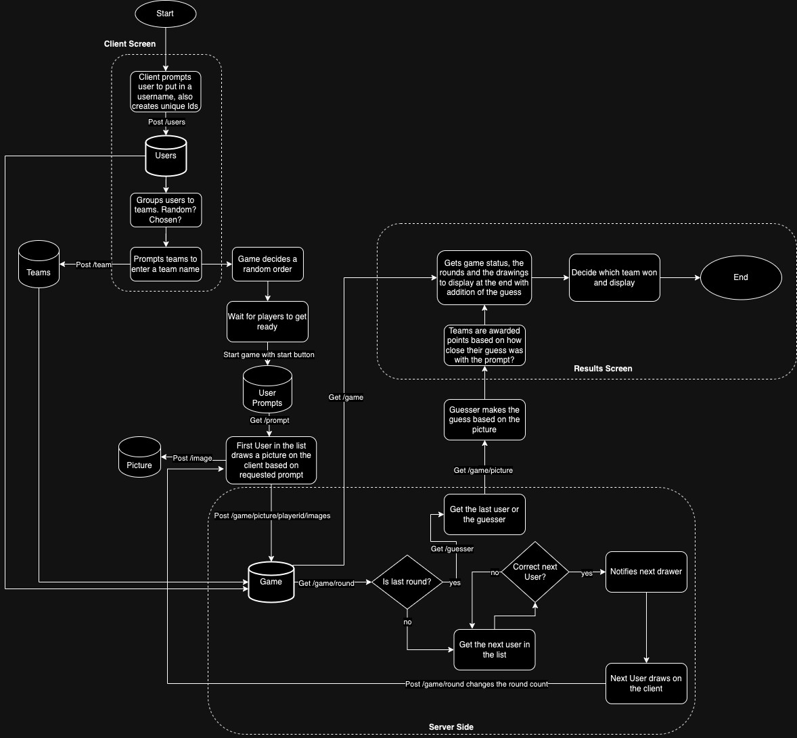

# DoodlePhone Project Proposal
A web app where teams of players compete against each other in a game of telephone but draw pictures instead of relaying a sentence.

## Non-Techinical Description

Our project is going to be an online multiplayer game similar to Gartic Phone’s Co-op gamemode. It’s a telephone game but instead of passing on a sentence to remember, each player passes a drawing and sequential players add to it. Two teams are made and there’s 1 designated guesser on each team. The first player is given a prompt and gets a short amount of time to draw the prompt. Afterwards, the drawing is handed off to the next player where they’ll add onto the drawing and so on. Once all players have drawn aside from the guessers, all players can view the progression of their pictures and see what their guessers thought the drawing was. 

We envision our target audience to be mainly kids, students, or even families. With the internet, our game can be accessible through long distances, so if an individual moves between households, it can be an enjoyable and heartwarming way to keep in touch with each other. We think that this game could be fun to use as an ice breaker game or for team building for clubs or friend groups. Our main focus is that we want users to feel less as strangers with the people they’re with if holding one-on-one conversations is too daunting. They can also get a better idea of the interests of their peers based on what they draw, how they communicate during the game, or how they respond to competition.

Our reason for making a game like this is that it sounds like a fun game while being a challenging project that will require us to be very mindful of how to design the architecture of a multiplayer game. Besides that, any project for school always seems like it has to be useful, productive or advanced in some way but we’ve never gotten to make an app that’s made for fun.

## Activity/Process Diagram

#### Detailed Data Flow
> We’re not too familiar with websockets yet, but from our understanding, we’ll be using its active connection with the server to broadcast events so that certain clients have different views whether they’re guessing, drawing, or waiting

1. User enters username
    * User domain object created via RESTful API endpoint
    * Game domain object is posted via REST API
    * Team domain object is posted via REST API

2. User chooses team to participate in
    * Team domain object updates its players list via RESTful API endpoint
3. When all players are ready, start button is clicked
4. Random prompt is retrieved from database
    * Query to MongoDB via mongoose library
5. User draws within their allotted time
    * Mouse input is captured on drawing canvas 
6. When time’s up, the next player draws
    * Current image from previous player is posted(REST API) to the Game domain object
    * Websocket broadcast to indicate a change in drawer, next drawer receives most recent image via query to Game object in db
This repeats for as many drawers there are in the game
7. Guesser receives final drawing and makes a guess of what the drawing is describing
    * Drawing is scored based on(Haven’t decided the scoring yet)
        * Option A: If prompts are phrases, each correct word
        * Option B: they get it or don’t with 1 word prompts
8. A nice to have in our game would be running multiple rounds, to which the score of the previous round is added and updated in the Game model object

### Database/ER Diagram

.png)

### User Stories

| Priority | User    | Description                                                | Technical Implementation                                                                                                                                                                             |
|----------|---------|------------------------------------------------------------|------------------------------------------------------------------------------------------------------------------------------------------------------------------------------------------------------|
| P0       | User    | I want to create a player name                             | When a user inputs the username, post a user document into the MongoDB database                                                                                                                      |
| P1       | User    | I want to choose a team to join                            | After the team document is made for a game, when the button to switch sides is clicked by a client, a post request is made to update the team player lists                                           |
| P1       | User    | I want to be notified when it's my turn                    | Websocket broadcast is sent to players. The next drawer will receive an alert that their turn has started. Once the alert is closed, the timer will begin for the player.                            |
| P0       | User    | I want to see the picture when it's my turn                | Make a GET request to retrieve game document then access currentPicture field. Parse the picture with a Base64 converter. Display the picture.                                                       |
| P0       | User    | I want to see how much time I have left to draw.           | After drawer closes alert about the current is their turn to draw, a `timeOut()` method is called with a callback to alert the drawer when their drawing time is up.                                 |
| P2       | User    | I want to see how our team's picture changes               | Retrieve each Team document and access the pictures field. Parse each picture and display them in a results container, pictures from each team side by side for each round.                          |
| P0       | User    | I want to know who won the game                            | After a POST request from both guessers, the server will compare answers to the prompt and return a results element detailing which team won.                                                        |
| P0       | Drawer  | I want to see the prompt                                   | A GET request is made to the userPrompts collection and a random document is returned in an HTML element.                                                                                            |
| P0       | Drawer  | I want to draw on the canvas                               | Use native HTML canvas element and register mouse events to make drawings.                                                                                                                           |
| P3       | Drawer  | I want access to a drawing tool bar                        | Import library with painting assets with notably changing brush color and size                                                                                                                       |
| P0       | Guesser | I want to guess the picture                                | Receive websocket broadcast that it's time for the guesser to guess the prompt. Make GET request to the current game document and retrieve the prompt field.                                         |
| P3       | Player  | I want to sabotage the other team so we may perform better | Send websocket broadcast to current drawers in a game round and sabotager may draw an image that would get transposed onto the other team's canvas or limit tools in toolbar by hiding it from view. |

## Endpoints

| Endpoint/Broadcast Event | Communication Type | Use Case                                                                                           |
|--------------------------|--------------------|----------------------------------------------------------------------------------------------------|
| /users/{id}              | GET                | Request a certain user based on its ID                                                             |
| /prompt                  | GET                | Request a random prompt for display                                                                |
| /games/{id}              | GET                | Request the current state of the game to be used by another user or at the end of the game         |
| /pictures/{gameID}       | GET                | Request the latest picture drawn by the previous drawer to be displayed                            |
| /teams                   | GET                | Request all the pictures created by each team to be displayed in a gallery at the end of the game. |
| /users                   | POST               | Add a user document to the users collection in the database                                        |
| /games                   | POST               | Add a game document to the games collection in the database                                        |
| /pictures                | POST               | Add a drawing to a player's respective team and update the latest picture in the game document     |
| "nextTurn"               | websockets         | Notifies the next drawer up for their team, calls to /pictures will be made                        |
| "startGame"              | websockets         | Starts the game for each player and their client should change to the game                         |
| "guess"                  | websockets               | Notifies guessers that it's their time to guess the picture their team drew                        |
| "updateTeams"            | websockets         | Updates the lobby to reflect the latest team change by a player on all client screens.             |